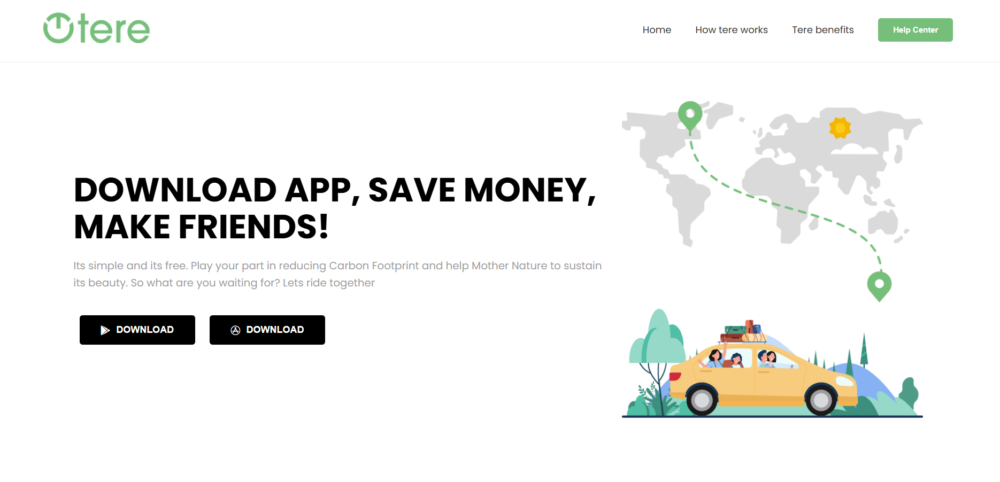
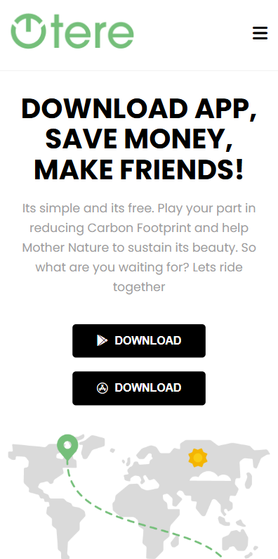

# Tere - Responsive Ride Sharing Landing Page

Tere is a modern, professional, and fully responsive landing page built for a ride-sharing application. This project focuses on clean UI, mobile-first responsiveness, and smooth user interaction.

## 🚀 Live Demo
https://hatesh1.github.io/tere-ride-sharing-landing-page

## ✨ Features
- **Fully Responsive Design:** Optimized for Desktop, Tablet, and Mobile screens.
- **Interactive Navigation:** Mobile-toggle (hamburger) menu implemented with JavaScript.
- **Optimized Layout:** Built using modern CSS techniques like **Flexbox** and **CSS Grid**.
- **Professional UI:** Clean typography using Google Fonts (Poppins) and high-quality icons from FontAwesome.
- **Section-wise Breakdown:**
    - Hero section with dual-platform download buttons.
    - Interactive "How It Works" steps with a custom circular image layout.
    - Benefits section with specialized grid-order for mobile viewing.
    - Modern Footer with professional alignment.

## 🛠️ Tech Stack
- **HTML5:** Semantic structure for SEO and accessibility.
- **CSS3:** Custom styling with a focus on responsiveness.
- **JavaScript:** For mobile menu toggle functionality.
- **FontAwesome:** For high-quality vector icons.
- **Google Fonts:** Poppins for a modern look.

## 📸 Screenshots
### Desktop View
 

### Mobile View


Markdown

## 📁 Project Structure
```text
├── index.html
├── style.css
├── mobile.png
├── car.png
└── ... (other assets)
```
Markdown
## 📝 Installation
## Clone the repository:
```text
git clone https://www.github.com/hatesh1/tere-ride-sharing-landing-page.git
```
## Run the project: 
Open index.html in your browser.

## 🤝 Contributing
Feel free to fork this project, open issues, or submit pull requests to help improve the design or functionality!

Developed by
Hatesh Lakhani 🚀

